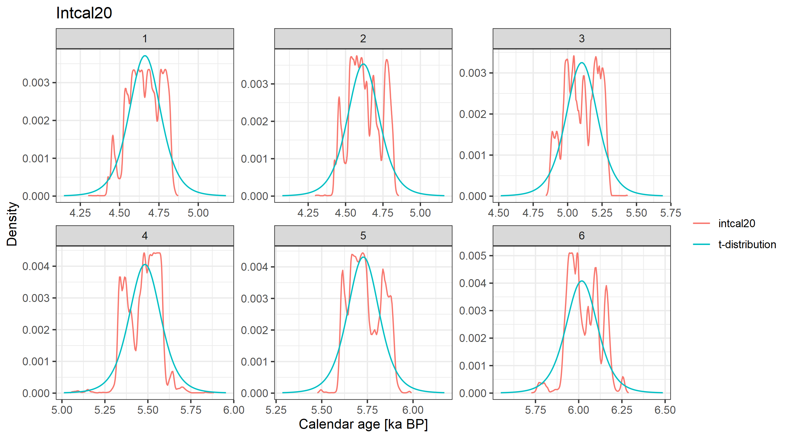
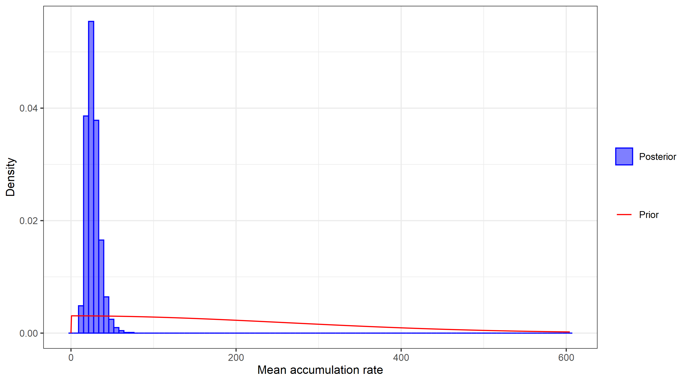
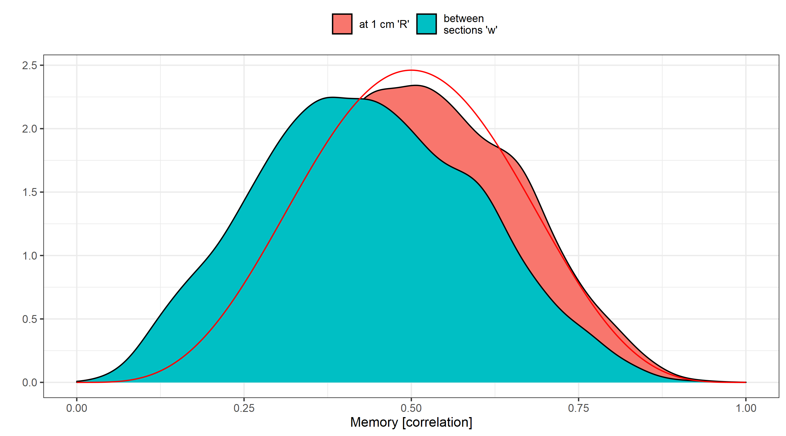
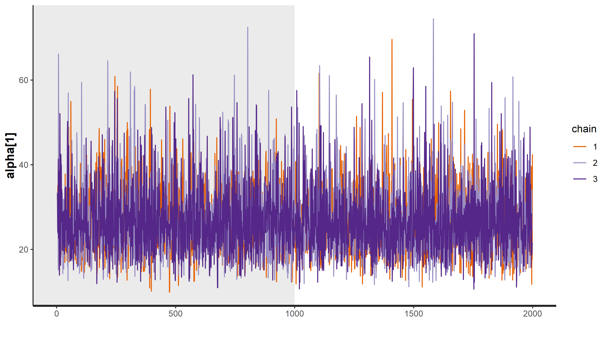

hamstr: Hierarchical Accumulation Modelling with Stan and R.
================
Andrew M. Dolman
2021-05-08

------------------------------------------------------------------------

**hamstr** implements a *Bacon-like* (Blaauw and Christen, 2011)
sediment accumulation or age-depth model with hierarchically structured
multi-resolution sediment sections. The Bayesian model is implemented in
the Stan probabilistic programming language (<https://mc-stan.org/>).

## Installation

**hamstr** can be installed directly from Github

``` r
if (!require("remotes")) {
  install.packages("remotes")
}

remotes::install_github("earthsystemdiagnostics/hamstr", args = "--preclean", build_vignettes = FALSE)
```

## Using **hamstr**

Examples using the example core “MSB2K” from the
[rbacon](https://cran.r-project.org/web/packages/rbacon/index.html)
package.

``` r
library(hamstr)
library(rstan)
library(tidyverse)
#> Warning: package 'tibble' was built under R version 4.0.3
#> Warning: package 'readr' was built under R version 4.0.3

set.seed(20200827)
```

### Converting radiocarbon ages to calendar ages.

Unlike Bacon, **hamstr** does not do the conversion of radiocarbon dates
to calendar ages as part of the model fitting process. This must be done
in advance. **hamstr** includes the helper function `calibrate_14C_age`
to do this, which in turn uses the function `BchronCalibrate` from the
[Bchron](https://cran.r-project.org/web/packages/Bchron/index.html)
package.

Additionally, unlike Bacon, **hamstr** approximates the complex
empirical calendar age PDF that results from calibration into a single
point estimate and 1-sigma uncertainty. This is a necessary compromise
in order to be able to use the power of the Stan platform. Viewed in
context with the many other uncertainties in radiocarbon dates and the
resulting age-models this will not usually be a major issue.

The function `calibrate_14C_age` will append columns to a data.frame
with the calendar ages and 1-sigma uncertainties.

``` r
MSB2K_cal <- calibrate_14C_age(MSB2K, age.14C = "age", age.14C.se = "error")
```

The approximated calendar age PDFs can be compared with the empirical
PDFs with the function `compare_14C_PDF`

A sample of six dates are plotted here for the IntCal20 and Marine20
calibrations. This approximation is much less of an issue for marine
radiocarbon dates, as the cosmogenic radiocarbon signal has been
smoothed by mixing in the ocean.

``` r
i <- seq(1, 40, by = floor(40/6))[1:6]
compare_14C_PDF(MSB2K$age[i], MSB2K$error[i], cal_curve = "intcal20")+
  labs(title = "Intcal20")
```

<!-- -->

``` r
compare_14C_PDF(MSB2K$age[i], MSB2K$error[i], cal_curve = "marine20") +
  labs(title = "Marine20")
```

<!-- -->

### Fitting age-models with **hamstr**

By default **hamstr** runs with three Markov chains and these can be run
in parallel. This code will assign 3 (processor) cores as long as the
machine has at least 3. The number of cores can also be set for specfic
calls of the `hamstr` function using the `cores` argument.

``` r
if (parallel::detectCores() >= 3) options(mc.cores = 3)
```

Age-depth (sediment accumulation) models are fit with the function
`hamstr`. A vectors of depth, observed age and age uncertainty are
passed as arguments to the function.

``` r
hamstr_fit_1 <- hamstr(depth = MSB2K_cal$depth,
                       obs_age = MSB2K_cal$age.14C.cal,
                       obs_err = MSB2K_cal$age.14C.cal.se)
```

The default plotting method shows the fitted age models together with
some diagnostic plots: a traceplot of the log-posterior to assess
convergence of the overall model; a plot of accumulation rate against
depth at each hierarchical level; the prior and posterior of the memory
parameter. By default the age-models are summarised to show the mean,
median, 25% and 95% posterior intervals. The data are shown as points
with their 1-sigma uncertainties. The structure of the sections is shown
along the top of the age-model plot.

``` r
plot(hamstr_fit_1)
#> Joining, by = "idx"
#> Joining, by = "alpha_idx"
```

<!-- -->

A “spaghetti” plot can be created instead of shaded regions. This shows
a random sample of iterations from the posterior distribution
(realisation of the age-depth model). This can be slow if lots of
iterations are plotted, the default is to plot 1000 iterations.
Additionally, plotting of the diagnostic plots can be switched off.

``` r
plot(hamstr_fit_1, summarise = FALSE, plot_diagnostics = FALSE)
#> Joining, by = "idx"
```

<!-- -->

#### Mean accumulation rate

There is no need to specify a prior value for the mean accumulation
rate, parameter `acc.mean` in Bacon, as in **hamstr**, this overall mean
accumulation rate is a full parameter estimated from the data.

By default, **hamstr** uses robust linear regression (`MASS::rlm`) to
estimate the mean accumulation rate from the data, and then uses this to
parametrise a prior distribution for the overall mean accumulation rate.
This prior is a half-normal with zero mean and standard deviation equal
to 10 times the estimated mean. Although this does introduce an element
of “data-peaking”, using the data twice (for both the prior and
likelihood), the resulting prior is only weakly-informative. The
advantage is that the prior is automatically scaled appropriately
regardless of the units of depth or age.

This prior can be checked visually against the posterior.

``` r
plot(hamstr_fit_1, type = "acc_mean_prior_post")
```

<!-- -->

Default parameter values for the shape of the accumulation prior
`acc_shape = 1.5`, the memory mean `mem_mean = 0.5` and strength
`mem_strength = 10`, are the same as for Bacon &gt;= 2.5.1.

#### Setting the thickness and number of discrete sections

One of the more critical tuning parameters in the **Bacon** model is the
parameter `thick`, which determines the thickness and number of discrete
core sections. Finding a good or optimal value for a given core is often
critical to getting a good age-depth model. Too few sections and the
resulting age-model is very “blocky” and can miss changes in
sedimentation rate; however, counter-intuitively, too many very thin
sections can also often result in an age-model that “under-fits” the
data - ploughing a straight line through the age-control points when a
lower resolution model shows variation in accumulation rate.

The key structural difference between **Bacon** and **hamstr** models is
that with **hamstr** the sediment core is modelled at multiple
resolutions simultaneously with a hierarchical structure. This removes
the need to trade-off smoothness and flexibility.

The parameter `K` controls the number and structure of the hierarchical
sections. It is specified as a vector, where each value indicates the
number of new child sections for each parent section at each finer
hierarchical level. E.g. `c(10, 10)` specifies 10 sections at the
coarsest level, with 10 new sections at the next finer level for each
coarse section, giving a total of 100 sections at the highest / finest
resolution level. `c(10, 10, 10)` would specify 1000 sections at the
finest level and 3 hierarchical levels of 10, 100 and 1000 sections.

The structure is hierarchical in the sense that the modelled
accumulation rates for the parent sections act as priors for their child
sections; specifically, the mean accumulation rate for a given parent is
the mean of the gamma prior for it’s child sections. In turn, the
overall mean accumulation rate for the whole core is itself a parameter
estimated by the fitting process. The hierarchical structure of
increasing resolution allows the model to adapt to low-frequency changes
in the accumulation rate, that is changes between “regimes” of high or
low accumulation that persist for long periods.

By default `K` is set to `c(10, 10)`.

Here is an example of a coarser model.

``` r
hamstr_fit_2 <- hamstr(depth = MSB2K_cal$depth,
                   obs_age = MSB2K_cal$age.14C.cal,
                   obs_err = MSB2K_cal$age.14C.cal.se,
                   K = c(5, 5))
```

``` r
plot(hamstr_fit_2)
#> Joining, by = "idx"
#> Joining, by = "alpha_idx"
```

<!-- -->

### Getting the fitted age models

The fitted age models can be obtained with the `predict` and `summary`
methods. *iter* is the iteration of the sampler, or “realisation” of the
age model.

``` r
predict(hamstr_fit_1)
#> Joining, by = "idx"
#> # A tibble: 120,000 x 3
#>     iter depth   age
#>    <int> <dbl> <dbl>
#>  1     1   1.5 4535.
#>  2     1   4.5 4587.
#>  3     1   8.5 4649.
#>  4     1  12.5 4704.
#>  5     1  14.5 4748.
#>  6     1  14.5 4748.
#>  7     1  14.5 4748.
#>  8     1  17.5 4825.
#>  9     1  20.5 4903.
#> 10     1  21.5 4946.
#> # ... with 119,990 more rows
```

`summary` returns the age model summarised over the realisations.

``` r
summary(hamstr_fit_1)
#> Joining, by = "idx"
#> # A tibble: 101 x 13
#>    depth   idx par    mean se_mean    sd `2.5%` `25%` `50%` `75%` `97.5%` n_eff
#>    <dbl> <dbl> <chr> <dbl>   <dbl> <dbl>  <dbl> <dbl> <dbl> <dbl>   <dbl> <dbl>
#>  1  1.5      1 c_ag~ 4532.    2.19  63.6  4393. 4494. 4537. 4575.   4643.  844.
#>  2  2.48     2 c_ag~ 4542.    2.00  59.7  4416. 4506. 4546. 4583.   4649.  892.
#>  3  3.46     3 c_ag~ 4553.    1.81  56.4  4431. 4519. 4556. 4590.   4657.  966.
#>  4  4.44     4 c_ag~ 4563.    1.65  53.4  4450. 4530. 4565. 4599.   4663. 1048.
#>  5  5.42     5 c_ag~ 4574.    1.51  51.0  4466. 4542. 4575. 4608.   4669. 1139.
#>  6  6.4      6 c_ag~ 4584.    1.39  49.0  4481. 4554. 4585. 4617.   4676. 1242.
#>  7  7.38     7 c_ag~ 4595.    1.30  47.4  4496. 4565. 4596. 4627.   4685. 1338.
#>  8  8.36     8 c_ag~ 4605.    1.22  46.2  4511. 4576. 4607. 4636.   4696. 1424.
#>  9  9.34     9 c_ag~ 4616.    1.19  45.3  4523. 4587. 4617. 4645.   4706. 1450.
#> 10 10.3     10 c_ag~ 4627.    1.22  45.1  4533. 4597. 4628. 4656.   4715. 1362.
#> # ... with 91 more rows, and 1 more variable: Rhat <dbl>
```

The hierarchical structure of the sections makes it difficult to specify
the exact depth resolution that you want for your resulting age-depth
model. The `predict` method takes an additional argument `depth` to
interpolate to a specific set of depths. The function returns NA for
depths that are outside the modelled depths.

``` r
age.mods.interp <- predict(hamstr_fit_1, new_depth = seq(0, 100, by = 1))
#> Joining, by = "idx"
```

These interpolated age models can summarised with the same function as
the original fitted objects, but the n\_eff and Rhat information is
lost.

``` r
summary(age.mods.interp)
#> # A tibble: 101 x 8
#>    depth  mean    sd `2.5%` `25%` `50%` `75%` `97.5%`
#>    <dbl> <dbl> <dbl>  <dbl> <dbl> <dbl> <dbl>   <dbl>
#>  1     0   NA   NA      NA    NA    NA    NA      NA 
#>  2     1   NA   NA      NA    NA    NA    NA      NA 
#>  3     2 4537.  61.5  4404. 4500. 4541. 4579.   4646.
#>  4     3 4548.  57.9  4423. 4513. 4551. 4586.   4653.
#>  5     4 4558.  54.7  4443. 4526. 4561. 4594.   4660.
#>  6     5 4569.  51.9  4459. 4537. 4571. 4604.   4666.
#>  7     6 4580.  49.7  4475. 4549. 4581. 4613.   4673.
#>  8     7 4591.  47.9  4491. 4561. 4592. 4623.   4680.
#>  9     8 4601.  46.5  4506. 4572. 4603. 4632.   4692.
#> 10     9 4612.  45.5  4519. 4583. 4613. 4642.   4702.
#> # ... with 91 more rows
```

### Diagnostic plots

Additional diagnostic plots are available. See ?plot.hamstr\_fit for
options.

#### Plot modelled accumulation rates at each hierarchical level

``` r
plot(hamstr_fit_1, type = "hier_acc")
#> Joining, by = "alpha_idx"
```

<!-- -->

#### Plot memory prior and posterior

As for this example the highest resolution sections are approximately 1
cm thick, there is not much difference between R and w.

``` r
plot(hamstr_fit_1, type = "mem")
```

<!-- -->

### Other `rstan` functions

Within the hamstr\_fit object is an *rstan* object on which all the
standard rstan functions should operate correctly.

For example:

``` r
rstan::check_divergences(hamstr_fit_1$fit)
#> 0 of 3000 iterations ended with a divergence.

rstan::stan_rhat(hamstr_fit_1$fit)
#> `stat_bin()` using `bins = 30`. Pick better value with `binwidth`.
#> Warning: Removed 3 rows containing non-finite values (stat_bin).
```

<!-- -->

The first `alpha` parameter is the overall mean accumulation rate.

``` r
rstan::traceplot(hamstr_fit_1$fit, par = c("alpha[1]"),
                 inc_warmup = TRUE)
```

<!-- -->

`alpha[2]` to `alpha[6]` will be the first 5 accumulations rates at the
coarsest hierarchical level.

``` r
plot(hamstr_fit_1, type = "hier")
#> Joining, by = "alpha_idx"
```

<!-- -->

``` r
rstan::traceplot(hamstr_fit_1$fit, par = paste0("alpha[", 2:6, "]"),
                 inc_warmup = TRUE)
```

<!-- -->

### References

-   Blaauw, Maarten, and J. Andrés Christen. 2011. Flexible Paleoclimate
    Age-Depth Models Using an Autoregressive Gamma Process. Bayesian
    Analysis 6 (3): 457-74. <doi:10.1214/ba/1339616472>.

-   Parnell, Andrew. 2016. Bchron: Radiocarbon Dating, Age-Depth
    Modelling, Relative Sea Level Rate Estimation, and Non-Parametric
    Phase Modelling. R package version 4.2.6.
    <https://CRAN.R-project.org/package=Bchron>

-   Stan Development Team (2020). RStan: the R interface to Stan. R
    package version 2.21.2. <http://mc-stan.org/>.
